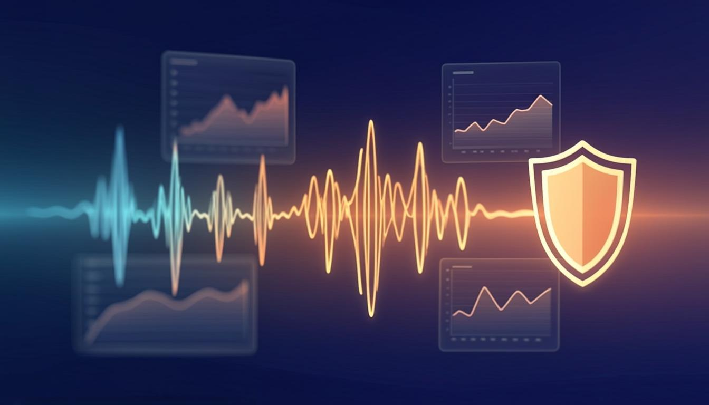
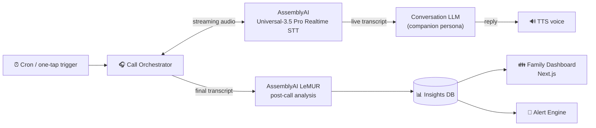

<div align="center">

# 📞 EverCall — Jarvis for Grandma

**A daily AI voice call for your elderly parents — and a wellbeing radar for the whole family.**

Built for the [AssemblyAI Voice Agent Hackathon](https://lablab.ai/ai-hackathons/assemblyai-voice-agent-hackathon) · Sep 1–30, 2026

[](LICENSE)
[](https://nextjs.org)
[](https://www.typescriptlang.org)
[](https://www.assemblyai.com)



*Every day, EverCall phones your grandmother for a real conversation. Every day, you know she's okay.*

[The Problem](#-the-problem) · [How It Works](#-how-it-works) · [Demo](#-demo) · [Quickstart](#-quickstart) · [Build Plan](#-build-plan) · [Team](#-the-squad)

</div>

---

## 💔 The Problem

Half of adults over 65 report feeling lonely, and chronic loneliness raises dementia risk by roughly 50% — comparable to smoking 15 cigarettes a day. Families want to check in daily, but life gets in the way: the average adult child calls their aging parent less than once a week, and when they do, one polite "I'm fine" hides everything that matters. Meanwhile, medication mix-ups and early cognitive decline show up in *speech* long before they show up anywhere else. The daily phone call is the single richest, cheapest health signal families are not capturing.

## ⚡ What EverCall Does

EverCall is a voice agent that **places a scheduled daily call** to your elderly parent and holds a warm, natural conversation — how the grandkids are doing, the neighbor's cat, whether she took her pills. After the call, the **wellbeing radar** takes over: speech AI reads between the lines so the family gets clarity instead of "I'm fine."

| Layer | What happens | AssemblyAI tech |
|---|---|---|
| 📞 The Call | Real-time conversation with a warm companion persona — chatting, gentle med nudges, no robot vibes | **Universal-3.5 Pro Realtime** streaming STT (endpointing tuned for slower, warmer speech) |
| 🧠 The Radar | Post-call report: mood via sentiment, missed meds, memory slips (repeated questions), caregiver joined | **LeMUR** post-call analysis + **Sentiment Analysis** + **Speaker Diarization** |
| 🚨 The Alert | Daily digest for the family + instant ping when something feels off | LeMUR severity scoring → alert engine |

**One killer demo:** a live call on screen, transcript streaming in real time, and the family dashboard updating the moment grandma hangs up.

## 🏗️ How It Works



Read the deep dives:

- [`docs/ARCHITECTURE.md`](docs/ARCHITECTURE.md) — system design and the full call lifecycle
- [`docs/VOICE_LOOP.md`](docs/VOICE_LOOP.md) — the real-time STT→LLM→TTS loop and turn-taking
- [`docs/API.md`](docs/API.md) — REST/WS contract + LeMUR prompt templates
- [`docs/BUILD_PLAN.md`](docs/BUILD_PLAN.md) — the 4-week squad plan, week by week

## 🎬 Demo

> 🎥 **3-minute demo video:** _link drops here at submission_ — script lives in the [`evercall-pitch`](https://github.com/Cubiczan/evercall-pitch) repo.

The demo mode runs **fully in the browser**: press *Trigger test call*, a simulated "grandma" (pre-recorded voice) chats with the agent, and you watch the radar light up — no phone number required. Real PSTN calls via Twilio Media Streams are the stretch goal.

## 🚀 Quickstart

```bash
git clone https://github.com/icohangar-ops/evercall.git
cd evercall
npm install
cp .env.example .env.local   # paste your AssemblyAI key
npm run dev                  # http://localhost:3000
```

> The scaffold boots with realistic mock data so you can develop the UI before touching voice. Everything AssemblyAI-related is stubbed behind `src/lib/assemblyai.ts` — grab a free API key at [assemblyai.com/dashboard](https://www.assemblyai.com/dashboard) and wire it up (see `docs/API.md`).

**Environment variables**

| Var | Required | Purpose |
|---|---|---|
| `ASSEMBLYAI_API_KEY` | ✅ | Realtime STT, LeMUR, diarization, sentiment |
| `DAILY_CALL_CRON` | — | Daily call schedule (cron format) |
| `TWILIO_*` | — | Real phone calls (stretch goal) |
| `FAMILY_ALERT_WEBHOOK_URL` | — | Slack/Discord/email alert relay |

## 📁 Project Structure

```
evercall/
├── src/
│   ├── app/
│   │   ├── page.tsx              # Family dashboard (the radar)
│   │   ├── layout.tsx
│   │   ├── globals.css           # Design tokens (teal/amber, warm & calm)
│   │   └── api/
│   │       ├── call/route.ts     # POST — trigger/schedule a call
│   │       ├── analysis/route.ts # GET — LeMUR wellbeing report
│   │       └── alerts/route.ts   # GET — family alert feed
│   ├── components/
│   │   ├── CallCard.tsx          # Next call + test-call trigger
│   │   ├── WellbeingRadar.tsx    # Mood / meds / memory / caregiver
│   │   ├── AlertFeed.tsx         # Family alerts
│   │   ├── MoodTrend.tsx         # 14-day sentiment sparkline
│   │   └── TestCallButton.tsx    # Client component → POST /api/call
│   └── lib/
│       ├── types.ts              # CallRecord / AnalysisResult / Alert
│       ├── mock.ts               # Realistic demo data
│       └── assemblyai.ts         # All AssemblyAI wiring (stubbed → TODO)
└── docs/                         # Architecture, voice loop, API, build plan
```

## 🗓️ Build Plan

Month-long hackathon → 4 weekly milestones. Full detail in [`docs/BUILD_PLAN.md`](docs/BUILD_PLAN.md).

| Week | Milestone | Exit criteria |
|---|---|---|
| **W1** (Sep 1–7) | 🎤 *Hello Voice* | Browser mic → live transcript via Universal-3.5 Pro Realtime |
| **W2** (Sep 8–14) | 💬 *The Conversation* | 2-minute natural two-way call, warm persona, tuned endpointing |
| **W3** (Sep 15–21) | 🧠 *The Radar* | LeMUR report → real dashboard data → first alert fired |
| **W4** (Sep 22–30) | 🏆 *Ship It* | Demo video, README, lablab page — **submitted ≥48h before deadline** |

## 👥 The Squad

4 builders, demo-first scope, structured build plan — we're here to ship something that matters.

| Role | Owns |
|---|---|
| 🎙️ Full-stack lead | Voice loop: realtime STT ⇄ LLM ⇄ TTS |
| 🖥️ Full-stack #2 | Dashboard, data viz, demo flow |
| 🔌 Full-stack #3 | LeMUR analysis, alerts, integrations |
| 🧭 Founder / PM | Product, demo video, submission, this README |

> 🤝 **We're recruiting 3 full-stack devs** (React/Next.js + API glue) — see our lablab team page or the [pitch repo](https://github.com/Cubiczan/evercall-pitch) for the vibe.

## 🙏 Thanks

- [AssemblyAI](https://www.assemblyai.com) — Universal-3.5 Pro Realtime, LeMUR, diarization & sentiment APIs
- [lablab.ai](https://lablab.ai) — for running the [Voice Agent Hackathon](https://lablab.ai/ai-hackathons/assemblyai-voice-agent-hackathon)

## 📄 License

[MIT](LICENSE) — build on it, care forward. ❤️
