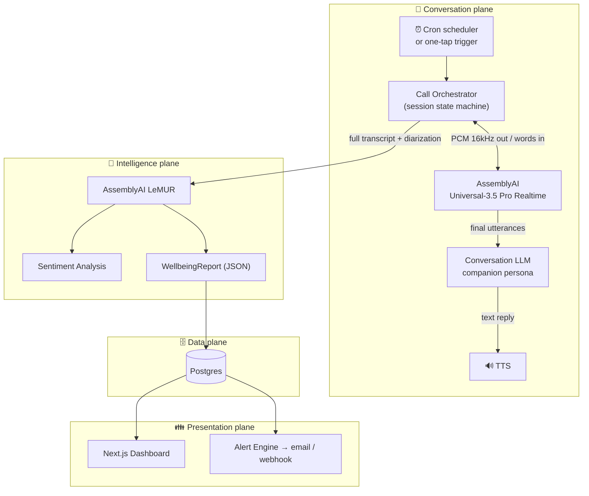

# 🏛️ EverCall — Architecture

> Audience: squad members + judges reading the repo. Goal: anyone can explain how a call becomes an alert in under 60 seconds.

## System Overview

EverCall has four planes:

1. **Conversation plane** — the live voice loop (streaming STT → LLM → TTS).
2. **Intelligence plane** — post-call analysis (LeMUR, sentiment, diarization).
3. **Data plane** — Postgres: calls, transcripts, insight reports, alerts.
4. **Presentation plane** — the Next.js family dashboard + alert engine.

## The Call Lifecycle

**1. Trigger.** Cron fires `DAILY_CALL_CRON`, or a family member hits *Trigger test call* → `POST /api/call`. Demo mode plays a pre-recorded "grandma" voice instead of dialing PSTN, so judges see the full loop without a telephony account.

**2. Session bootstrap.** The orchestrator creates a `CallRecord` (status `in_progress`), opens a WebSocket to AssemblyAI Universal-3.5 Pro Realtime (16 kHz PCM), and greets with the persona's opening line via TTS.

**3. Live conversation.** Audio flows in; AssemblyAI streams partial → final transcripts. Only *final* utterances advance the turn. The LLM replies under the companion persona (see `VOICE_LOOP.md` for turn-taking, endpointing, barge-in).

**4. Hangup.** The persona closes naturally ("Enjoy your tea, Ruth — talk tomorrow!") or max-duration (8 min) fires. `CallRecord` → `completed`, final transcript + diarization segments stored.

**5. The Radar.** The transcript goes to LeMUR with our analysis prompt (`docs/API.md#lemur-prompts`), producing a strict-JSON `WellbeingReport`:

| Field | Source | Example |
|---|---|---|
| `mood.label` / `mood.score` | LeMUR + Sentiment API | `positive`, `0.82` |
| `medsTaken` | LeMUR extraction over med list | `true` |
| `memorySlips` | repeated-question detection | `1` (asked about neighbor ×3) |
| `caregiverJoined` | **Speaker Diarization** speaker count | `true` |
| `highlights` | quotable moments | "Granddaughter recital on Friday" |
| `severity` | LeMUR rubric | `info` \| `warning` \| `urgent` |

**6. Alerting.** `severity >= warning` → alert row + `FAMILY_ALERT_WEBHOOK_URL` delivery. Everything else rolls into the 18:00 daily digest ("Mom sounded cheerful, pills taken — she mentioned the recital twice 🎹").

## Key Design Decisions

| Decision | Rationale | Rejected alternative |
|---|---|---|
| **Browser demo mode first** | Judges + devs need zero telephony setup; Twilio is a thin adapter later | Twilio-only MVP (blocks everyone without an account) |
| **Final-utterance turn-taking** | Elderly speech has long pauses; partials would cause interruptions | Barge-in on partials (feels rude, cuts grandma off) |
| **LeMUR for analysis, not an ad-hoc LLM chain** | LeMUR consumes the transcript natively — no copy-pasting transcripts between providers | Raw GPT call on pasted text (more glue, worse cost) |
| **Strict JSON schema from LeMUR** | Dashboard renders without fragile parsing | Free-form summary text |
| **8-min call cap** | Cost control + respect for grandma's afternoon | Unlimited duration |

## Failure Modes & Fallbacks

| Failure | Detection | Fallback |
|---|---|---|
| STT WebSocket drops | WS close/error event | Auto-reconnect ×3, then mark call `missed` + alert family |
| No answer / busy | Orchestrator timeout (45 s) | Retry in 30 min → "Missed check-in" info alert |
| LeMUR returns invalid JSON | Schema validation | One retry with "JSON only" reminder → store raw text + `severity: warning` |
| Grandma mentions emergency keywords | LeMUR rubric (`urgent`) | Immediate alert, always — no digest batching |

## What We Are NOT Building (Scope Discipline)

- ❌ Not a medical device — no diagnoses, only signals ("worth a check-in")
- ❌ No fall detection / wearables integration (out of scope for a month)
- ❌ No multi-language support in MVP (English persona first)
